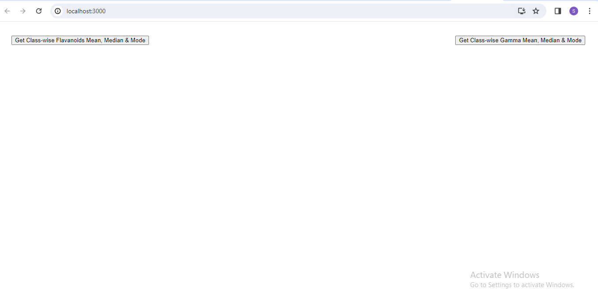
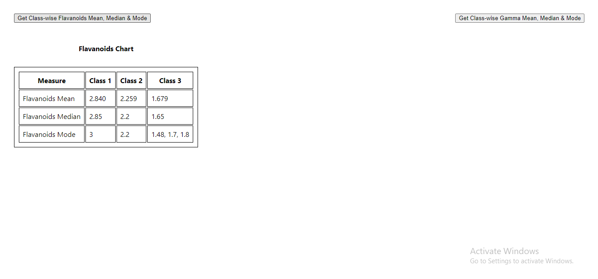
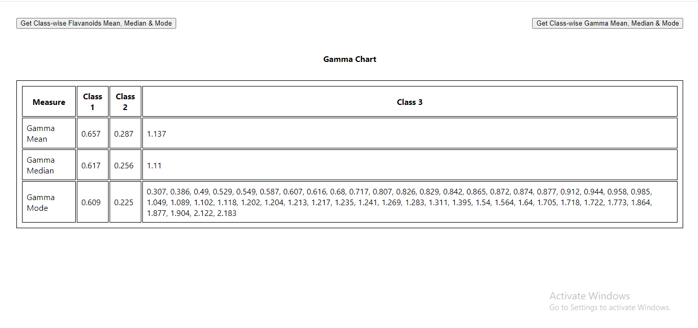
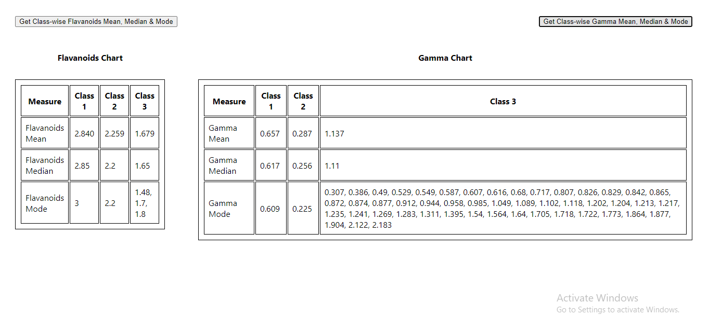

TO RUN THIS APPLICATION -

FOLLOW THESE STEPS-
1. In Terminal, run this code - "git clone https://github.com/Shivvu26/wine-data.git" 
2. Now go inside the app project folder & open the terminal, run this code - "npm install"
3. After successfull run of npm install, run this code - "npm start"

THE PROJECT WILL RUN ON THE BROWSER.
THERE ARE BUTTONS TO GET THE CALCULATED VALUES OF FLAVANOID & GAMMA PROPERTIES. CLICK ON IT & RESULT WILL BE DISPLAYED IN A TABULAR FORMAT.

Initial Screen -

Flavanoids Data -

Gamma Data -

Flavanoids & Gamma Data -

